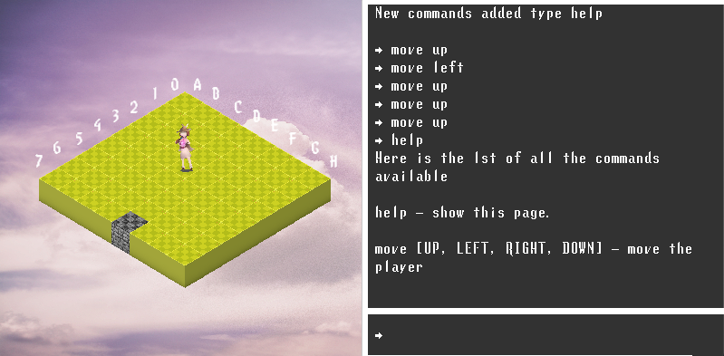

<h1 align="center">Polarized</h1>
<h3 align="center">A isometric x terminal game interface</h3>

 - Little preview

<h6>  Installation :</h6>

start run the sketch with processing

<h6>  Controls :</h6>

   - type help in the right terminal to see available commands

- 🌱 Made at 42

